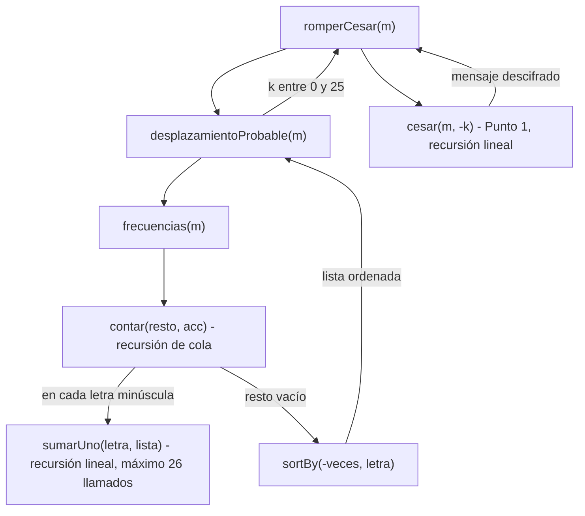

# Ejemplo de informe de corrección

Fundamentos de Programación Funcional y Concurrente.
Documento realizado por el docente Juan Francisco Díaz.

## 1. Argumentar la corrección de programas recursivos

Sea $f : A \to B$ una función, y $A$ un conjunto definido recursivamente
(recordar la definición de Matemáticas Discretas I), como por ejemplo los
naturales o las listas.

Sea $P_f$ un programa recursivo (lineal o en árbol) desarrollado en Scala (o en
cualquier lenguaje de programación) hecho para calcular $f$:

```scala
def Pf(a: A): B = { // Pf recibe a de tipo A, y devuelve f(a) de tipo B
  ...
}
```

¿Cómo argumentar que $P_f(a)$ siempre devuelve $f(a)$ como respuesta? Es decir,
¿cómo argumentar que $P_f$ es correcto con respecto a su especificación?

La respuesta es sencilla: demostrando el siguiente teorema.

```math
\forall a \in A : P_f(a) == f(a)
```

Cuando uno tiene que demostrar que algo se cumple para todos los elementos de
un conjunto definido recursivamente, es natural usar inducción estructural. En
términos prácticos, esto significa demostrar que:

- Para cada valor básico $a$ de $A$, se tiene que $P_f(a) == f(a)$.
- Para cada valor $a \in A$ construido recursivamente a partir de otro(s)
  valor(es) $a' \in A$, se tiene que
  $P_f(a') == f(a') \rightarrow P_f(a) == f(a)$. (Esta es la hipótesis de
  inducción).

### Ejemplo: factorial recursivo

Sea $f : \mathbb{N} \to \mathbb{N}$ la función que calcula el factorial de un
número natural, es decir, $f(n) = n!$. Y sea $P_f$ el siguiente programa en
Scala:

```scala
def Pf(n: Int): Int = { // Pf recibe n de tipo Int, y devuelve n! de tipo Int
  if (n == 0) 1 else n * Pf(n - 1)
}
```

Vamos a demostrar que $\forall n \in \mathbb{N} : P_f(n) == n!$

**Caso base:** $n = 0$

```math
P_f(0) \rightarrow \text{if } (0 == 0)\ 1 \text{ else } 0 \ast P_f(-1) \rightarrow 1
```

Por otro lado, $f(0) = 0! = 1$. Entonces $P_f(0) == f(0)$.

**Caso de inducción:** $n = k + 1$, $k \geq 0$. Hay que demostrar:
$P_f(k) == f(k) \rightarrow P_f(k + 1) == f(k + 1)$

```math
P_f(k+1) \rightarrow \text{if } (k+1 == 0)\ 1 \text{ else } (k+1) \ast P_f(k) \rightarrow (k+1) \ast P_f(k)
```

Usando la hipótesis de inducción (HI):

```math
\rightarrow (k+1) \ast k! = (k+1)!
```

Por lo tanto, $P_f(k + 1) == f(k + 1)$.

Concluimos por inducción que $\forall n \in \mathbb{N} : P_f(n) == n!$

### Ejemplo: el máximo de una lista

Sea $f : \text{List}[\mathbb{N}] \to \mathbb{N}$ la función que calcula el
máximo de una lista de enteros positivos, no vacía. Y sea $P_f$ el siguiente
programa en Scala:

```scala
def maxLin(l: List[Int]): Int = {
  if (l.tail.isEmpty) l.head
  else math.max(maxLin(l.tail), l.head)
}
```

Demostraremos que:

```math
\forall n \in \mathbb{N} \setminus \{0\} : P_f(\text{List}(a_1, a_2, \ldots, a_n)) == f(\text{List}(a_1, a_2, \ldots, a_n))
```

**Caso base:** $n = 1$

```math
P_f(\text{List}(a_1)) \rightarrow \text{if } \text{List}(a_1).\text{tail.isEmpty then } \text{List}(a_1).\text{head else } \ldots \rightarrow \text{List}(a_1).\text{head} \rightarrow a_1
```

Por otro lado, $f(\text{List}(a_1)) = a_1$. Entonces
$P_f(\text{List}(a_1)) == f(\text{List}(a_1))$.

**Caso de inducción:** $n = k + 1$, $k \geq 1$. Se debe demostrar:

```math
P_f(\text{List}(b_1, b_2, \ldots, b_k)) == f(\text{List}(b_1, b_2, \ldots, b_k)) \rightarrow P_f(\text{List}(a_1, a_2, \ldots, a_{k+1})) == f(\text{List}(a_1, a_2, \ldots, a_{k+1}))
```

Empecemos por calcular qué devuelve $P_f$ usando el modelo de sustitución:

```math
P_f(L) \rightarrow \text{if } L.\text{tail.isEmpty then } L.\text{head else math.max}(P_f(L.\text{tail}), L.\text{head})
```

```math
\rightarrow \text{math.max}(P_f(\text{List}(a_2, \ldots, a_{k+1})), a_1)
```

Sea $b = P_f(\text{List}(a_2, \ldots, a_{k+1}))$; por la hipótesis de
inducción, $b = f(\text{List}(a_2, \ldots, a_{k+1}))$. Hay dos posibilidades:

- Si $\text{math.max}(b, a_1) = b$, entonces $b \geq a_1$ y
 $b == f(\text{List}(a_1, a_2, \ldots, a_{k+1}))$.
- Si $\text{math.max}(b, a_1) = a_1$, entonces $a_1 \geq b$ y
 $a_1 == f(\text{List}(a_1, a_2, \ldots, a_{k+1}))$.

Por lo tanto, $P_f(L) == f(L)$.

Concluimos por inducción que:

```math
\forall n \in \mathbb{N} \setminus \{0\} : P_f(\text{List}(a_1, a_2, \ldots, a_n)) == f(\text{List}(a_1, a_2, \ldots, a_n))
```

## 2. Argumentar la corrección de programas iterativos

Para argumentar la corrección de programas iterativos, se debe formalizar cómo
es la iteración. Esto implica definir:

- Cómo se representa un estado de la iteración, $s$.
- Cuál es el estado inicial, $s_0$.
- Cuál es el estado final (o cómo se reconoce que un estado es final): $s_f$.
- Qué condición (o predicado) cumple todo estado: $\text{Inv}(s)$ (invariante
  de la iteración).
- El mecanismo para pasar de un estado al siguiente: $\text{transformar}(s)$.
  Si $s_i$ es el estado $i$, entonces $\text{transformar}(s_i) = s_{i+1}$.

Un programa iterativo tiene la siguiente forma:

```scala
def Pf(a: A): B = { // Pf recibe a de tipo A, y devuelve f(a) de tipo B
  def Pf_iter(s: Estado): B =
    if (esFinal(s)) respuesta(s) else Pf_iter(transformar(s))
  Pf_iter(s0)
}
```

Demostración de corrección:

- $\text{Inv}(s_0)$: el estado inicial cumple la condición invariante.
- Si $(s_i \neq s_f \land \text{Inv}(s_i)) \rightarrow \text{Inv}(\text{transformar}(s_i))$:
  el nuevo estado cumple la condición invariante si el estado anterior la
  cumplía.
- De lo anterior se concluye $\text{Inv}(s_f)$, es decir, el estado final
  cumple la condición invariante. Luego,
  $\text{Inv}(s_f) \rightarrow \text{respuesta}(s_f) == f(a)$.
- Finalmente, demostrar que siempre se llega al estado final $s_f$. Esto
  implica que
  $P_f(a) == \text{iter}(s_0) == \text{respuesta}(s_f) == f(a)$.

### Ejemplo: factorial iterativo

Considere el siguiente programa iterativo en Scala para calcular la función
factorial:

```scala
def Pf(n: Int): Int = { // Pf recibe n de tipo Int, y devuelve n! de tipo Int
  def Pf_iter(i: Int, n: Int, ac: Int): Int =
    if (i > n) ac else Pf_iter(i + 1, n, i * ac)
  Pf_iter(1, n, 1)
}
```

Este programa implementa el siguiente proceso iterativo:

- Un estado $s = (i, n, ac)$.
- El estado inicial es $s_0 = (1, n, 1)$.
- $(i, n, ac)$ es final si $i > n$, o lo que es lo mismo, si $i = n + 1$.
- La invariante de ciclo es
  $\text{Inv}(i, n, ac) \equiv i \leq n + 1 \land ac = (i-1)!$.
  La invariante de ciclo es una relación que SIEMPRE se cumple en el ciclo.
- $\text{transformar}((i, n, ac)) = (i+1, n, i \ast ac)$.

Ahora, demostramos los puntos mencionados:

**1.** $\text{Inv}(s_0)$: el estado inicial cumple la condición invariante.

```math
s_0 = (1, n, 1) \implies 1 \leq n + 1 \land 1 = 0!
```

**2.** La invariante se mantiene con la transformación de estados,
$(s_i \neq s_f \land \text{Inv}(s_i)) \rightarrow \text{Inv}(\text{transformar}(s_i))$:

1. Primer cambio, $i = i + 1$, lo que implica $ac = ((i+1) - 1)! = i!$.
2. Segundo cambio, $ac = i \ast ac$, entonces $ac = (i - 1)! \ast i = i!$.
3. Como se puede ver en ambos cambios indicados en la transformación, la
   invariante se mantiene.

**3.** $\text{Inv}(s_f) \rightarrow \text{respuesta}(s_f) == f(a)$

```math
(n + 1 \leq n + 1) \land ac = ((n+1)-1)! \rightarrow ac == n!
```

**4.** En cada paso, la componente $i$ del estado incrementa, acercándose a $n+1$.
Después de $n$ iteraciones, se alcanza $n+1$.

Esto implica que $P_f(n) == \text{iter}(1, n, 1) == n!$

### Ejemplo: el máximo de una lista

Se desea calcular el máximo de una lista de enteros positivos, no vacía. Sea
$f : \text{List}[\mathbb{N}] \to \mathbb{N}$ la función que calcula ese valor.
Y sea $P_f$ el siguiente programa en Scala:

```scala
def maxIt(l: List[Int]): Int = {
  def maxAux(max: Int, l: List[Int]): Int = {
    if (l.isEmpty) max
    else maxAux(math.max(max, l.head), l.tail)
  }
  maxAux(l.head, l.tail)
}
```

Este programa implementa el siguiente proceso iterativo:

- Un estado $s = (max, l)$ donde $l = \text{List}(a_i, a_{i+1}, \ldots, a_k)$
  es una cola de $L$.
- El estado inicial es
  $s_0 = (L.\text{head}, L.\text{tail}) = (a_1, \text{List}(a_2, \ldots, a_k))$.
- $s = (max, l)$ es final si $l$ es vacía.
- $\text{Inv}(max, l) \equiv l = \text{List}(a_i, a_{i+1}, \ldots, a_k) \land max = f(\text{List}(a_1, a_2, \ldots, a_{i-1}))$.
- $\text{transformar}((max, l)) = (nmax, l.\text{tail})$ donde $nmax = max$ si
  $max \geq l.\text{head}$, y $nmax = l.\text{head}$ si no.

Demostración de los puntos:

**1.** $\text{Inv}(s_0)$: el estado inicial cumple la condición invariante.

```math
s_0 = (a_1, \text{List}(a_2, \ldots, a_k)) \implies a_1 = f(\text{List}(a_1))
```

**2.** $(s_i \neq s_f \land \text{Inv}(s_i)) \rightarrow \text{Inv}(\text{transformar}(s_i))$

```math
\neg\, l.\text{isEmpty} \land l = \text{List}(a_i, a_{i+1}, \ldots, a_k) \land max = f(\text{List}(a_1, a_2, \ldots, a_{i-1}))
```

```math
\rightarrow l.\text{tail} = \text{List}(a_{i+1}, \ldots, a_k) \land nmax = f(\text{List}(a_1, \ldots, a_i))
```

**3.** $\text{Inv}(s_f) \rightarrow \text{respuesta}(s_f) == f(a)$

```math
\text{Inv}((max, \text{List}())) \rightarrow max = f(\text{List}(a_1, \ldots, a_k))
```

**4.** En cada paso, la lista $l$ se reduce, acercándose a ser vacía. Después de
$k$ iteraciones, $l = \text{List}()$.

Esto implica que $P_f(L) == \text{maxAux}(L.\text{head}, L.\text{tail}) == f(L)$


# Punto 3: corrección de frecuencias

## Lo que debe hacer la función

Para un mensaje $w$ y una letra minúscula $y$, llamemos $|w|_y$ al número de
veces que $y$ aparece en $w$. Por ejemplo, $|\text{casa}|_a = 2$.

Para una lista de parejas $L$, llamemos $N_y(L)$ al número que acompaña a la
letra $y$ en $L$, y $0$ si $y$ no está en $L$. Por ejemplo,
$N_a(\text{List}((c,1),(a,2))) = 2$ y $N_s(\text{List}((c,1),(a,2))) = 0$.

La especificación de `frecuencias` es: $f(m)$ es la lista de parejas $(y, |m|_y)$
de todas las letras minúsculas con $|m|_y > 0$, ordenada de mayor a menor
$|m|_y$ y, en empate, por orden alfabético de $y$.

La función está hecha con dos auxiliares, así que se argumenta la corrección de
cada una y después cómo se juntan.

## sumarUno: recursión lineal

```scala
def sumarUno(letra: Char, lista: Frecuencias): Frecuencias = {
  if (lista.isEmpty) {List((letra, 1))}
  else if (lista.head._1 == letra) {(letra, lista.head._2 + 1) :: lista.tail}
  else {lista.head :: sumarUno(letra, lista.tail)}
}
```

Sea $L$ una lista de parejas en la que ninguna letra se repite. Lo que debe
cumplir `sumarUno` es que, para toda letra $y$:

```math
N_y(\text{sumarUno}(x, L)) = \begin{cases} N_y(L) + 1 & \text{si } y = x \\ N_y(L) & \text{si } y \neq x \end{cases}
```

y que en la lista resultante tampoco se repita ninguna letra. Se demuestra por
inducción sobre la longitud $n$ de $L$.

**Caso base:** $n = 0$, es decir $L = \text{List}()$.

```math
\text{sumarUno}(x, \text{List}()) \rightarrow \text{if } (\text{List}().\text{isEmpty})\ \text{List}((x,1)) \ldots \rightarrow \text{List}((x,1))
```

$N_x(\text{List}((x,1))) = 1 = 0 + 1 = N_x(L) + 1$, y para cualquier otra letra
$y$ queda $0 = N_y(L)$. Se cumple.

**Caso de inducción:** $L = (l, v) :: L'$, donde $L'$ tiene longitud $k$ y la
hipótesis de inducción (HI) dice que `sumarUno` es correcta para $L'$. Hay dos
posibilidades:

- Si $l = x$:

```math
\text{sumarUno}(x, (x,v) :: L') \rightarrow (x, v+1) :: L'
```

  La pareja de $x$ pasa de $v$ a $v + 1$ y el resto de la lista no cambia.
  Como $x$ no se repetía en $L$, tampoco está en $L'$. Se cumple.

- Si $l \neq x$:

```math
\text{sumarUno}(x, (l,v) :: L') \rightarrow (l, v) :: \text{sumarUno}(x, L')
```

  Por la HI, $\text{sumarUno}(x, L')$ es $L'$ con la letra $x$ sumada una vez.
  Se le pega adelante $(l, v)$, que no cambia; y como $l \neq x$ y $l$ no
  estaba en $L'$, no queda repetida. Se cumple.

Concluimos por inducción que `sumarUno` es correcta para toda lista sin letras
repetidas. Además, como solo hay 26 letras, la lista nunca tiene más de 26
parejas y `sumarUno` deja como mucho 26 llamados pendientes.

## contar: recursión de cola

```scala
@tailrec
def contar(resto: Mensaje, acc: Frecuencias): Frecuencias = {
  if (resto.isEmpty) {acc}
  else {
    val c = resto.head
    val nuevoAcc = if (esMinuscula(c)) {sumarUno(c, acc)} else {acc}
    contar(resto.tail, nuevoAcc)
  }
}
```

Sea $m = c_1 c_2 \ldots c_n$ el mensaje. Este programa implementa el
siguiente proceso iterativo:

- Un estado $s = (\text{resto}, \text{acc})$.
- El estado inicial es $s_0 = (m, \text{List}())$.
- $(\text{resto}, \text{acc})$ es final si $\text{resto}$ es vacío.
- La invariante: si $w$ es la parte del mensaje que ya se recorrió, es decir
  $m = w \cdot \text{resto}$, entonces el acumulador cuenta exactamente las
  letras de $w$:

```math
\text{Inv}(\text{resto}, \text{acc}) \equiv m = w \cdot \text{resto} \land \forall y \in \{a, \ldots, z\} : N_y(\text{acc}) = |w|_y
```

- $\text{transformar}((c \cdot r, \text{acc})) = (r, \text{sumarUno}(c, \text{acc}))$
  si $c$ es letra minúscula, y $(r, \text{acc})$ si no lo es.

Demostración de los puntos:

**1.** $\text{Inv}(s_0)$: al empezar no se ha recorrido nada, $w$ es vacío.

```math
s_0 = (m, \text{List}()) \implies m = \text{""} \cdot m \land N_y(\text{List}()) = 0 = |\text{""}|_y
```

**2.** $(s_i \neq s_f \land \text{Inv}(s_i)) \rightarrow \text{Inv}(\text{transformar}(s_i))$.
Si $\text{resto} = c \cdot r$, después del paso lo recorrido es $w \cdot c$.

- Si $c$ es minúscula, por la corrección de `sumarUno`:

```math
N_y(\text{sumarUno}(c, \text{acc})) = N_y(\text{acc}) + [y = c] = |w|_y + [y = c] = |w \cdot c|_y
```

  donde $[y = c]$ vale $1$ si $y = c$ y $0$ si no.

- Si $c$ no es minúscula, el acumulador no cambia y tampoco cambia el conteo de
  letras minúsculas: $|w \cdot c|_y = |w|_y$.

En los dos casos la invariante se mantiene.

**3.** $\text{Inv}(s_f) \rightarrow \text{respuesta}(s_f) == f(m)$. En el
estado final $\text{resto}$ es vacío, entonces $w = m$:

```math
\text{Inv}(\text{""}, \text{acc}) \rightarrow \forall y : N_y(\text{acc}) = |m|_y
```

Es decir, `acc` tiene una pareja $(y, |m|_y)$ por cada letra que aparece en
$m$, y ninguna pareja de letras que no aparecen.

**4.** En cada paso $\text{resto}$ pierde su primer carácter. Después de $n$
iteraciones $\text{resto}$ es vacío y se llega al estado final.

Como la llamada a `contar` es lo último que se hace, el compilador acepta
`@tailrec` y el proceso corre en espacio constante: por eso la prueba con un
mensaje de 100000 letras no desborda la pila.

## El ordenamiento

```scala
contar(m, List()).sortBy(par => (-par._2, par._1))
```

`contar` ya devuelve las parejas correctas (punto 3 de arriba), solo que en el
orden en que aparecieron. `sortBy` las ordena por la pareja
$(-\text{veces}, \text{letra})$: primero el que tenga $-\text{veces}$ más
pequeño, es decir más veces; y si empatan, la letra menor alfabéticamente.
Como ninguna letra se repite, ese orden no deja dudas y el resultado es
exactamente $f(m)$.

Concluimos que $\forall m : \text{frecuencias}(m) == f(m)$.

# Punto 4: corrección de desplazamientoProbable y romperCesar

## desplazamientoProbable

```scala
def desplazamientoProbable(m: Mensaje): Int = {
  val lista = frecuencias(m)
  if (lista.isEmpty) {0}
  else {
    val masFrecuente = lista.head._1
    ((masFrecuente.toInt - 'e'.toInt) % letras + letras) % letras
  }
}
```

Llamemos $p(x)$ a la posición de una letra, de $p(a) = 0$ a $p(z) = 25$.
La especificación es:

```math
d(m) = \begin{cases} 0 & \text{si } m \text{ no tiene letras minúsculas} \\ (p(l^*) - p(e)) \bmod 26 & \text{si no} \end{cases}
```

donde $l^*$ es la letra más frecuente de $m$ y, si hay empate, la menor
alfabéticamente.

Esta función no es recursiva: hace un llamado a `frecuencias` y una cuenta.

- **Sin letras:** por el Punto 3, $\text{frecuencias}(m) = \text{List}()$,
  entonces entra por `lista.isEmpty` y devuelve $0$.
- **Con letras:** por el Punto 3, la primera pareja de la lista es la letra
  con más veces y, en empate, la menor alfabéticamente. Entonces
  `lista.head._1` es justo $l^*$.

Falta ver que la cuenta da $(p(l^*) - 4) \bmod 26$. Como
$x.\text{toInt} = 97 + p(x)$, la resta de códigos ASCII es la resta de
posiciones:

```math
l^*.\text{toInt} - e.\text{toInt} = (97 + p(l^*)) - (97 + 4) = p(l^*) - 4 = a
```

con $-4 \leq a \leq 21$. En Scala, `%` deja el signo del número que se divide,
así que $`a \,\%\, 26`$ puede ser negativo. Por eso se suma $26$:

```math
-26 < a \,\%\, 26 < 26 \implies 0 < (a \,\%\, 26) + 26 < 52 \implies 0 \leq ((a \,\%\, 26) + 26) \,\%\, 26 \leq 25
```

Y como sumar $26$ no cambia el residuo, el resultado es $a \bmod 26$. Por
ejemplo con $l^* = a$: $`((-4) \,\%\, 26 + 26) \,\%\, 26 = 22 \,\%\, 26 = 22`$.

Concluimos que $\forall m : \text{desplazamientoProbable}(m) == d(m)$.

## romperCesar

```scala
def romperCesar(m: Mensaje): Mensaje = {
  val k = desplazamientoProbable(m)
  cesar(m, -k)
}
```

Por la corrección de `cesar` (Punto 1), $\text{cesar}(m, k)$ corre cada letra
minúscula $k$ posiciones, con $p' = (p + k) \bmod 26$, y deja igual lo demás.
Entonces `romperCesar` hace exactamente lo que dice el enunciado: corre el
mensaje hacia atrás el desplazamiento estimado,

```math
\text{romperCesar}(m) == \text{cesar}(m, -d(m))
```

Lo que no siempre se cumple es que **adivine** el mensaje original. Si el
original $m$ se cifró con $k$, cifrar con $k$ y después con $-d$ es lo mismo
que cifrar con $k - d$:

```math
\text{romperCesar}(\text{cesar}(m, k)) == \text{cesar}(m, k - d) \quad\text{donde } d = d(\text{cesar}(m, k))
```

Si $m$ tiene al menos una letra minúscula, eso es igual a $m$ solo si
$(k - d) \bmod 26 = 0$, es decir si $d = k \bmod 26$.

Además, `cesar` cambia cada letra por otra distinta, pero no cambia cuántas
veces aparece: si $\sigma(y)$ es la letra $y$ corrida $k$ posiciones,

```math
|\text{cesar}(m, k)|_{\sigma(y)} = |m|_y
```

Por eso, si la letra que gana en el mensaje cifrado es $\sigma(e)$, la que
antes era la $e$, entonces $d = (p(\sigma(e)) - 4) \bmod 26 = k \bmod 26$ y se
recupera el original.

## Cuándo falla romperCesar

Según lo anterior, el método falla cuando la letra que gana en el mensaje
cifrado **no** es la que antes era la $e$. Eso pasa en dos casos:

**1. La e no es la letra más frecuente del original.** Pasa con mensajes
cortos, con mensajes que casi no tienen $e$, o con textos en otro idioma. El
método supone que la letra que más se repite es la $e$, y si no lo es, se
equivoca.

Mensaje concreto: `"solo como pollo"`, cifrado con $k = 5$.

- $\text{frecuencias}(\text{"solo como pollo"}) = \text{List}((o,6), (l,3), (c,1), (m,1), (p,1), (s,1))$:
  la letra que más se repite es la $o$ y la $e$ no aparece.
- $\text{cesar}(\text{"solo como pollo"}, 5) = \text{"xtqt htrt utqqt"}$, y la
  más frecuente pasa a ser la $t$ (la $o$ corrida 5).
- $d = (p(t) - 4) \bmod 26 = (19 - 4) \bmod 26 = 15 \neq 5$.
- $\text{romperCesar}(\text{"xtqt htrt utqqt"}) = \text{cesar}(\text{"xtqt htrt utqqt"}, -15) = \text{"iebe sece febbe"}$.

El método cree que la $t$ era una $e$, así que todas las $o$ del original
salen convertidas en $e$. El resultado no es el mensaje original. Este caso
está en las pruebas propias (`PruebasPuntos3y4Test.scala`).

**2. La e empata con otra letra.** En un empate gana la letra menor
alfabéticamente **del mensaje cifrado**, no del original. Al correr las
letras, el orden alfabético puede cambiar porque al pasarse de la $z$ se
vuelve a la $a$. Con `"eso"` las tres letras aparecen una vez:

- Con $k = 3$: $\text{cesar}(\text{"eso"}, 3) = \text{"hvr"}$. Gana la $h$, que
  era la $e$, y $\text{romperCesar}(\text{"hvr"}) = \text{"eso"}$. Acierta.
- Con $k = 10$: $\text{cesar}(\text{"eso"}, 10) = \text{"ocy"}$. Gana la $c$,
  que era la $s$, entonces $d = (2 - 4) \bmod 26 = 24 \neq 10$ y
  $\text{romperCesar}(\text{"ocy"}) = \text{"qea"}$. Falla.

El mismo mensaje se rompe bien o mal según la clave con que se cifró.

## Cómo se encadenan los llamados

`romperCesar` no hace el trabajo sola: llama a `desplazamientoProbable`, que
llama a `frecuencias`, que hace el recorrido con `contar` y en cada letra usa
`sumarUno`. Cuando ya tiene el desplazamiento, `romperCesar` llama a `cesar`
del Punto 1. Por eso su corrección depende de la corrección de cada una de
esas funciones, que es lo que se argumentó arriba.




## Corrección de `combinaciones`

```scala
def combinaciones(n: Int, a: Int): BigInt =
  if (n == 0) BigInt(1)
  else if (n == 1) BigInt(a)
  else BigInt(a - 1) * combinaciones(n - 1, a)
```

### Qué debe calcular

Queremos contar las palabras de largo $n$ que se pueden formar con $a$ letras
sin que haya dos letras iguales seguidas. La primera letra puede ser cualquiera
($a$ opciones) y cada letra siguiente puede ser cualquiera menos la anterior
($a - 1$ opciones). Por eso:

```math
f(n, a) = \begin{cases} 1 & \text{si } n = 0 \\ a \cdot (a-1)^{n-1} & \text{si } n \geq 1 \end{cases}
```

Hay que mostrar que $combinaciones(n, a) == f(n, a)$ para todo $n \geq 0$.

### Casos base

**$n = 0$:** el programa entra al primer `if` y devuelve $1$. Solo existe una
palabra de largo cero, la vacía, así que $f(0, a) = 1$. Coinciden.

**$n = 1$:** el programa entra al segundo `if` y devuelve $a$. Con una sola
letra cualquiera sirve, y $f(1, a) = a \cdot (a-1)^0 = a$. Coinciden.

### Caso de inducción

Suponemos que el programa funciona para un $k \geq 1$, es decir:

```math
combinaciones(k, a) = a \cdot (a-1)^{k-1} \quad \text{(hipótesis de inducción)}
```

Para $n = k + 1$ el programa no entra a ningún caso base, así que calcula:

```math
combinaciones(k+1, a) \rightarrow (a-1) \cdot combinaciones(k, a)
```

Usando la hipótesis:

```math
(a-1) \cdot a \cdot (a-1)^{k-1} = a \cdot (a-1)^{k} = f(k+1, a)
```

En palabras: las palabras de largo $k+1$ son las de largo $k$ con una letra más
al final, y esa letra tiene $a - 1$ opciones porque no puede repetir la
anterior.

### Conclusión

Los casos base se cumplen y, si el programa funciona para $k$, también funciona
para $k + 1$. Por inducción, $combinaciones(n, a) == f(n, a)$ para todo
$n \geq 0$.
