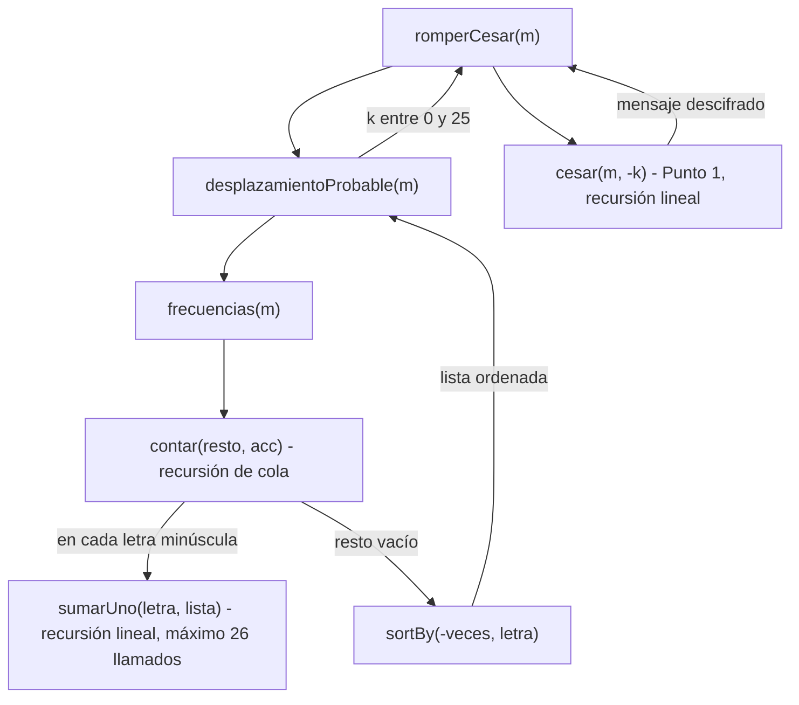

<<<<<<< HEAD
# Informe de corrección

Fundamentos de Programación Funcional y Concurrente.
Taller 1 — Cifrados clásicos con recursión.

## 1. César con recursión lineal: `cesar`

### Especificación

Sea $L = \{a, b, \ldots, z\}$ el conjunto de las 26 letras minúsculas, y sea
$\text{ord}(c)$ el código numérico del carácter $c$ (con
$\text{ord}(a) = 97$, que en el programa es la constante `primera`).

Cifrar un carácter $c$ con desplazamiento $k \in \mathbb{Z}$ es correrlo $k$
posiciones en el alfabeto, de forma circular, si es una letra minúscula, y
dejarlo igual si no lo es:

```math
\text{cifrar}(c, k) =
\begin{cases}
\text{chr}\big((\text{ord}(c) - 97 + k) \bmod 26 + 97\big) & \text{si } c \in L \\
c & \text{si } c \notin L
\end{cases}
```

Sea $f : \text{Mensaje} \times \mathbb{Z} \to \text{Mensaje}$ la función que
cifra un mensaje completo, carácter por carácter. Para un mensaje
$m = c_1 c_2 \ldots c_n$:

```math
f(c_1 c_2 \ldots c_n,\ k) = \text{cifrar}(c_1, k)\ \text{cifrar}(c_2, k) \ldots \text{cifrar}(c_n, k)
```

En particular, $f(\text{""}, k) = \text{""}$.

### Programa

Sea $P_f$ el siguiente programa en Scala:

```scala
def cesar(m: Mensaje, k: Int): Mensaje = {
  if (m.isEmpty) { "" }
  else {
    val c = m.head
    val charCifrado = if (c.isLetter && esMinuscula(c)) {
      (((c.toInt - primera + k) % 26 + letras) % 26 + primera).toChar
    } else {
      c
    }
    charCifrado + cesar(m.tail, k)
  }
}
```

### El cifrado de un carácter es correcto

Primero se muestra que `charCifrado` es exactamente $\text{cifrar}(c, k)$.

- Si $c \notin L$, la condición `c.isLetter && esMinuscula(c)` es falsa y
  `charCifrado` $= c = \text{cifrar}(c, k)$.
- Si $c \in L$, sea $x = \text{ord}(c) - 97 + k$. En Scala, `x % 26` puede ser
  negativo cuando $x < 0$ (por ejemplo, si $k$ es negativo), pero siempre
  cumple $-26 < x \,\%\, 26 < 26$. Entonces $x \,\%\, 26 + 26$ es positivo, y

```math
(x \,\%\, 26 + 26) \,\%\, 26 = x \bmod 26 \in \{0, 1, \ldots, 25\}
```

  Por lo tanto `charCifrado`
  $= \text{chr}\big((\text{ord}(c) - 97 + k) \bmod 26 + 97\big) = \text{cifrar}(c, k)$,
  que siempre es una letra de $L$.

### Demostración

Vamos a demostrar, por inducción sobre la longitud $n$ del mensaje, que:

```math
\forall n \in \mathbb{N},\ \forall k \in \mathbb{Z} : P_f(c_1 c_2 \ldots c_n,\ k) == f(c_1 c_2 \ldots c_n,\ k)
```

**Caso base:** $n = 0$, es decir, $m = \text{""}$.

```math
P_f(\text{""}, k) \rightarrow \text{if } (\text{"".isEmpty})\ \text{""} \text{ else } \ldots \rightarrow \text{""}
```

Por otro lado, $f(\text{""}, k) = \text{""}$. Entonces
$P_f(\text{""}, k) == f(\text{""}, k)$.

**Caso de inducción:** $n = j + 1$, $j \geq 0$. Sea
$m = c_1 c_2 \ldots c_{j+1}$, de modo que $m.\text{head} = c_1$ y
$m.\text{tail} = c_2 \ldots c_{j+1}$, que tiene longitud $j$. Hay que demostrar:

```math
P_f(c_2 \ldots c_{j+1},\ k) == f(c_2 \ldots c_{j+1},\ k) \rightarrow P_f(c_1 c_2 \ldots c_{j+1},\ k) == f(c_1 c_2 \ldots c_{j+1},\ k)
```

Usando el modelo de sustitución, como $m$ no es vacío:

```math
P_f(m, k) \rightarrow \text{if } (m.\text{isEmpty})\ \text{""} \text{ else } \{\ldots\ \text{charCifrado} + P_f(m.\text{tail}, k)\}
```

```math
\rightarrow \text{cifrar}(c_1, k) + P_f(c_2 \ldots c_{j+1},\ k)
```

Usando la hipótesis de inducción (HI):

```math
\rightarrow \text{cifrar}(c_1, k) + f(c_2 \ldots c_{j+1},\ k)
```

```math
= \text{cifrar}(c_1, k)\ \text{cifrar}(c_2, k) \ldots \text{cifrar}(c_{j+1}, k) = f(c_1 c_2 \ldots c_{j+1},\ k)
```

Por lo tanto, $P_f(m, k) == f(m, k)$.

Concluimos por inducción que:

```math
\forall m \in \text{Mensaje},\ \forall k \in \mathbb{Z} : \text{cesar}(m, k) == f(m, k)
```

## 2. César con recursión de cola: `cesarCola`

### Especificación

La función que se calcula es la misma $f$ de la sección anterior: dado un
mensaje $M = c_1 c_2 \ldots c_n$ y un desplazamiento $k$,

```math
f(c_1 c_2 \ldots c_n,\ k) = \text{cifrar}(c_1, k)\ \text{cifrar}(c_2, k) \ldots \text{cifrar}(c_n, k)
```

De esta definición sale una propiedad que se usa más abajo: cifrar un mensaje
partido en dos es lo mismo que cifrar cada parte y pegarlas,

```math
f(p\, q,\ k) = f(p, k) + f(q, k)
```

porque $f$ cifra cada carácter por separado, sin mirar a los demás.

### Programa

Sea $P_f$ el siguiente programa en Scala:

```scala
@tailrec
final def cesarCola(m: Mensaje, k: Int, acc: Mensaje = ""): Mensaje = {
  if (m.isEmpty) { acc }
  else {
    val c = m.head
    val charCifrado = if (c.isLetter && esMinuscula(c)) {
      (((c.toInt - primera + k) % 26 + letras) % 26 + primera).toChar
    } else {
      c
    }
    cesarCola(m.tail, k, acc + charCifrado)
=======
## Punto 3: corrección de frecuencias

### Lo que debe hacer la función

Para un mensaje $w$ y una letra minúscula $y$, llamemos $|w|_y$ al número de
veces que $y$ aparece en $w$. Por ejemplo, $|\text{casa}|_a = 2$.

Para una lista de parejas $L$, llamemos $N_y(L)$ al número que acompaña a la
letra $y$ en $L$, y $0$ si $y$ no está en $L$. Por ejemplo,
$N_a(\text{List}((c,1),(a,2))) = 2$ y $N_s(\text{List}((c,1),(a,2))) = 0$.

La especificación de `frecuencias` es: $f(m)$ es la lista de parejas $(y, |m|_y)$
de todas las letras minúsculas con $|m|_y > 0$, ordenada de mayor a menor
$|m|_y$ y, en empate, por orden alfabético de $y$.

La función está hecha con dos auxiliares, así que se argumenta la corrección de
cada una y después cómo se juntan.

### sumarUno: recursión lineal

```scala
def sumarUno(letra: Char, lista: Frecuencias): Frecuencias = {
  if (lista.isEmpty) {List((letra, 1))}
  else if (lista.head._1 == letra) {(letra, lista.head._2 + 1) :: lista.tail}
  else {lista.head :: sumarUno(letra, lista.tail)}
}
```

Sea $L$ una lista de parejas en la que ninguna letra se repite. Lo que debe
cumplir `sumarUno` es que, para toda letra $y$:

```math
N_y(\text{sumarUno}(x, L)) = \begin{cases} N_y(L) + 1 & \text{si } y = x \\ N_y(L) & \text{si } y \neq x \end{cases}
```

y que en la lista resultante tampoco se repita ninguna letra. Se demuestra por
inducción sobre la longitud $n$ de $L$.

**Caso base:** $n = 0$, es decir $L = \text{List}()$.

```math
\text{sumarUno}(x, \text{List}()) \rightarrow \text{if } (\text{List}().\text{isEmpty})\ \text{List}((x,1)) \ldots \rightarrow \text{List}((x,1))
```

$N_x(\text{List}((x,1))) = 1 = 0 + 1 = N_x(L) + 1$, y para cualquier otra letra
$y$ queda $0 = N_y(L)$. Se cumple.

**Caso de inducción:** $L = (l, v) :: L'$, donde $L'$ tiene longitud $k$ y la
hipótesis de inducción (HI) dice que `sumarUno` es correcta para $L'$. Hay dos
posibilidades:

- Si $l = x$:

```math
\text{sumarUno}(x, (x,v) :: L') \rightarrow (x, v+1) :: L'
```

  La pareja de $x$ pasa de $v$ a $v + 1$ y el resto de la lista no cambia.
  Como $x$ no se repetía en $L$, tampoco está en $L'$. Se cumple.

- Si $l \neq x$:

```math
\text{sumarUno}(x, (l,v) :: L') \rightarrow (l, v) :: \text{sumarUno}(x, L')
```

  Por la HI, $\text{sumarUno}(x, L')$ es $L'$ con la letra $x$ sumada una vez.
  Se le pega adelante $(l, v)$, que no cambia; y como $l \neq x$ y $l$ no
  estaba en $L'$, no queda repetida. Se cumple.

Concluimos por inducción que `sumarUno` es correcta para toda lista sin letras
repetidas. Además, como solo hay 26 letras, la lista nunca tiene más de 26
parejas y `sumarUno` deja como mucho 26 llamados pendientes.

### contar: recursión de cola

```scala
@tailrec
def contar(resto: Mensaje, acc: Frecuencias): Frecuencias = {
  if (resto.isEmpty) {acc}
  else {
    val c = resto.head
    val nuevoAcc = if (esMinuscula(c)) {sumarUno(c, acc)} else {acc}
    contar(resto.tail, nuevoAcc)
>>>>>>> eaba6a0d6c6fed337435ef0b865fc8946ab45caf
  }
}
```

<<<<<<< HEAD
La llamada recursiva es lo último que hace la función, y la anotación
`@tailrec` hace que el compilador lo verifique. Por eso el programa es un
proceso iterativo: `cesarCola` cumple el papel de la función `iter`, y el
llamado inicial `cesarCola(M, k)` usa el valor por defecto `acc = ""`.

El cálculo de `charCifrado` es el mismo de `cesar`, así que, por lo mostrado
en la sección 1, `charCifrado` $= \text{cifrar}(c, k)$.

### Proceso iterativo

Este programa implementa el siguiente proceso iterativo:

- Un estado $s = (m, k, acc)$, donde $m$ es la parte del mensaje que falta
  por cifrar y $acc$ es lo que ya se cifró. El desplazamiento $k$ no cambia.
- El estado inicial es $s_0 = (M, k, \text{""}) = (c_1 c_2 \ldots c_n,\ k,\ \text{""})$.
- $(m, k, acc)$ es final si $m$ es vacío, y la respuesta es $acc$.
- La invariante de ciclo es: lo que falta es una cola de $M$, y lo acumulado
  es el cifrado de todo lo que va antes de esa cola.

```math
\text{Inv}(m, k, acc) \equiv m = c_i \ldots c_n \land acc = f(c_1 \ldots c_{i-1},\ k), \quad 1 \leq i \leq n + 1
```

  Cuando $i = n + 1$, $m$ es vacío.

- $\text{transformar}((m, k, acc)) = (m.\text{tail},\ k,\ acc + \text{cifrar}(m.\text{head}, k))$.

Ahora, demostramos los puntos mencionados:

**1.** $\text{Inv}(s_0)$: el estado inicial cumple la condición invariante.

Con $i = 1$:

```math
s_0 = (c_1 \ldots c_n,\ k,\ \text{""}) \implies m = c_1 \ldots c_n \land \text{""} = f(\text{""}, k)
```

Lo que va antes de $c_1$ es el mensaje vacío, y su cifrado es $\text{""}$.

**2.** La invariante se mantiene con la transformación de estados,
$(s_i \neq s_f \land \text{Inv}(s_i)) \rightarrow \text{Inv}(\text{transformar}(s_i))$:

Si $s_i$ no es final, $m$ no es vacío, y por la invariante

```math
m = c_i\, c_{i+1} \ldots c_n \land acc = f(c_1 \ldots c_{i-1},\ k)
```

con $i \leq n$. Al transformar el estado:

1. Primer cambio, $m = m.\text{tail} = c_{i+1} \ldots c_n$: lo que falta
   sigue siendo una cola de $M$, una posición más adelante.
2. Segundo cambio, $acc = acc + \text{cifrar}(c_i, k)$, entonces

```math
acc = f(c_1 \ldots c_{i-1},\ k) + \text{cifrar}(c_i, k) = f(c_1 \ldots c_i,\ k)
```

3. El nuevo estado cumple la invariante con $i + 1$ en lugar de $i$:

```math
\text{Inv}(c_{i+1} \ldots c_n,\ k,\ f(c_1 \ldots c_i,\ k))
```

**3.** $\text{Inv}(s_f) \rightarrow \text{respuesta}(s_f) == f(M, k)$

En el estado final $m$ es vacío, así que $i = n + 1$:

```math
\text{Inv}(\text{""}, k, acc) \rightarrow acc = f(c_1 \ldots c_n,\ k) = f(M, k)
```

y la respuesta del programa en ese estado es justamente $acc$.

**4.** En cada paso, $m$ pierde su primer carácter, es decir, su longitud
disminuye en 1, acercándose a ser vacío. Después de $n$ iteraciones,
$m = \text{""}$ y se alcanza el estado final.

Esto implica que:

```math
P_f(M, k) == \text{cesarCola}(M, k, \text{""}) == f(M, k)
```
=======
Sea $m = c_1 c_2 \ldots c_n$ el mensaje. Este programa implementa el
siguiente proceso iterativo:

- Un estado $s = (\text{resto}, \text{acc})$.
- El estado inicial es $s_0 = (m, \text{List}())$.
- $(\text{resto}, \text{acc})$ es final si $\text{resto}$ es vacío.
- La invariante: si $w$ es la parte del mensaje que ya se recorrió, es decir
  $m = w \cdot \text{resto}$, entonces el acumulador cuenta exactamente las
  letras de $w$:

```math
\text{Inv}(\text{resto}, \text{acc}) \equiv m = w \cdot \text{resto} \land \forall y \in \{a, \ldots, z\} : N_y(\text{acc}) = |w|_y
```

- $\text{transformar}((c \cdot r, \text{acc})) = (r, \text{sumarUno}(c, \text{acc}))$
  si $c$ es letra minúscula, y $(r, \text{acc})$ si no lo es.

Demostración de los puntos:

**1.** $\text{Inv}(s_0)$: al empezar no se ha recorrido nada, $w$ es vacío.

```math
s_0 = (m, \text{List}()) \implies m = \text{""} \cdot m \land N_y(\text{List}()) = 0 = |\text{""}|_y
```

**2.** $(s_i \neq s_f \land \text{Inv}(s_i)) \rightarrow \text{Inv}(\text{transformar}(s_i))$.
Si $\text{resto} = c \cdot r$, después del paso lo recorrido es $w \cdot c$.

- Si $c$ es minúscula, por la corrección de `sumarUno`:

```math
N_y(\text{sumarUno}(c, \text{acc})) = N_y(\text{acc}) + [y = c] = |w|_y + [y = c] = |w \cdot c|_y
```

  donde $[y = c]$ vale $1$ si $y = c$ y $0$ si no.

- Si $c$ no es minúscula, el acumulador no cambia y tampoco cambia el conteo de
  letras minúsculas: $|w \cdot c|_y = |w|_y$.

En los dos casos la invariante se mantiene.

**3.** $\text{Inv}(s_f) \rightarrow \text{respuesta}(s_f) == f(m)$. En el
estado final $\text{resto}$ es vacío, entonces $w = m$:

```math
\text{Inv}(\text{""}, \text{acc}) \rightarrow \forall y : N_y(\text{acc}) = |m|_y
```

Es decir, `acc` tiene una pareja $(y, |m|_y)$ por cada letra que aparece en
$m$, y ninguna pareja de letras que no aparecen.

**4.** En cada paso $\text{resto}$ pierde su primer carácter. Después de $n$
iteraciones $\text{resto}$ es vacío y se llega al estado final.

Como la llamada a `contar` es lo último que se hace, el compilador acepta
`@tailrec` y el proceso corre en espacio constante: por eso la prueba con un
mensaje de 100000 letras no desborda la pila.

### El ordenamiento

```scala
contar(m, List()).sortBy(par => (-par._2, par._1))
```

`contar` ya devuelve las parejas correctas (punto 3 de arriba), solo que en el
orden en que aparecieron. `sortBy` las ordena por la pareja
$(-\text{veces}, \text{letra})$: primero el que tenga $-\text{veces}$ más
pequeño, es decir más veces; y si empatan, la letra menor alfabéticamente.
Como ninguna letra se repite, ese orden no deja dudas y el resultado es
exactamente $f(m)$.

Concluimos que $\forall m : \text{frecuencias}(m) == f(m)$.

## Punto 4: corrección de desplazamientoProbable y romperCesar

### desplazamientoProbable

```scala
def desplazamientoProbable(m: Mensaje): Int = {
  val lista = frecuencias(m)
  if (lista.isEmpty) {0}
  else {
    val masFrecuente = lista.head._1
    ((masFrecuente.toInt - 'e'.toInt) % letras + letras) % letras
  }
}
```

Llamemos $p(x)$ a la posición de una letra, de $p(a) = 0$ a $p(z) = 25$.
La especificación es:

```math
d(m) = \begin{cases} 0 & \text{si } m \text{ no tiene letras minúsculas} \\ (p(l^*) - p(e)) \bmod 26 & \text{si no} \end{cases}
```

donde $l^*$ es la letra más frecuente de $m$ y, si hay empate, la menor
alfabéticamente.

Esta función no es recursiva: hace un llamado a `frecuencias` y una cuenta.

- **Sin letras:** por el Punto 3, $\text{frecuencias}(m) = \text{List}()$,
  entonces entra por `lista.isEmpty` y devuelve $0$.
- **Con letras:** por el Punto 3, la primera pareja de la lista es la letra
  con más veces y, en empate, la menor alfabéticamente. Entonces
  `lista.head._1` es justo $l^*$.

Falta ver que la cuenta da $(p(l^*) - 4) \bmod 26$. Como
$x.\text{toInt} = 97 + p(x)$, la resta de códigos ASCII es la resta de
posiciones:

```math
l^*.\text{toInt} - e.\text{toInt} = (97 + p(l^*)) - (97 + 4) = p(l^*) - 4 = a
```

con $-4 \leq a \leq 21$. En Scala, `%` deja el signo del número que se divide,
así que $`a \,\%\, 26`$ puede ser negativo. Por eso se suma $26$:

```math
-26 < a \,\%\, 26 < 26 \implies 0 < (a \,\%\, 26) + 26 < 52 \implies 0 \leq ((a \,\%\, 26) + 26) \,\%\, 26 \leq 25
```

Y como sumar $26$ no cambia el residuo, el resultado es $a \bmod 26$. Por
ejemplo con $l^* = a$: $`((-4) \,\%\, 26 + 26) \,\%\, 26 = 22 \,\%\, 26 = 22`$.

Concluimos que $\forall m : \text{desplazamientoProbable}(m) == d(m)$.

### romperCesar

```scala
def romperCesar(m: Mensaje): Mensaje = {
  val k = desplazamientoProbable(m)
  cesar(m, -k)
}
```

Por la corrección de `cesar` (Punto 1), $\text{cesar}(m, k)$ corre cada letra
minúscula $k$ posiciones, con $p' = (p + k) \bmod 26$, y deja igual lo demás.
Entonces `romperCesar` hace exactamente lo que dice el enunciado: corre el
mensaje hacia atrás el desplazamiento estimado,

```math
\text{romperCesar}(m) == \text{cesar}(m, -d(m))
```

Lo que no siempre se cumple es que **adivine** el mensaje original. Si el
original $m$ se cifró con $k$, cifrar con $k$ y después con $-d$ es lo mismo
que cifrar con $k - d$:

```math
\text{romperCesar}(\text{cesar}(m, k)) == \text{cesar}(m, k - d) \quad\text{donde } d = d(\text{cesar}(m, k))
```

Si $m$ tiene al menos una letra minúscula, eso es igual a $m$ solo si
$(k - d) \bmod 26 = 0$, es decir si $d = k \bmod 26$.

Además, `cesar` cambia cada letra por otra distinta, pero no cambia cuántas
veces aparece: si $\sigma(y)$ es la letra $y$ corrida $k$ posiciones,

```math
|\text{cesar}(m, k)|_{\sigma(y)} = |m|_y
```

Por eso, si la letra que gana en el mensaje cifrado es $\sigma(e)$, la que
antes era la $e$, entonces $d = (p(\sigma(e)) - 4) \bmod 26 = k \bmod 26$ y se
recupera el original.

### Cuándo falla romperCesar

Según lo anterior, el método falla cuando la letra que gana en el mensaje
cifrado **no** es la que antes era la $e$. Eso pasa en dos casos:

**1. La e no es la letra más frecuente del original.** Pasa con mensajes
cortos, con mensajes que casi no tienen $e$, o con textos en otro idioma. El
método supone que la letra que más se repite es la $e$, y si no lo es, se
equivoca.

Mensaje concreto: `"solo como pollo"`, cifrado con $k = 5$.

- $\text{frecuencias}(\text{"solo como pollo"}) = \text{List}((o,6), (l,3), (c,1), (m,1), (p,1), (s,1))$:
  la letra que más se repite es la $o$ y la $e$ no aparece.
- $\text{cesar}(\text{"solo como pollo"}, 5) = \text{"xtqt htrt utqqt"}$, y la
  más frecuente pasa a ser la $t$ (la $o$ corrida 5).
- $d = (p(t) - 4) \bmod 26 = (19 - 4) \bmod 26 = 15 \neq 5$.
- $\text{romperCesar}(\text{"xtqt htrt utqqt"}) = \text{cesar}(\text{"xtqt htrt utqqt"}, -15) = \text{"iebe sece febbe"}$.

El método cree que la $t$ era una $e$, así que todas las $o$ del original
salen convertidas en $e$. El resultado no es el mensaje original. Este caso
está en las pruebas propias (`PruebasPuntos3y4Test.scala`).

**2. La e empata con otra letra.** En un empate gana la letra menor
alfabéticamente **del mensaje cifrado**, no del original. Al correr las
letras, el orden alfabético puede cambiar porque al pasarse de la $z$ se
vuelve a la $a$. Con `"eso"` las tres letras aparecen una vez:

- Con $k = 3$: $\text{cesar}(\text{"eso"}, 3) = \text{"hvr"}$. Gana la $h$, que
  era la $e$, y $\text{romperCesar}(\text{"hvr"}) = \text{"eso"}$. Acierta.
- Con $k = 10$: $\text{cesar}(\text{"eso"}, 10) = \text{"ocy"}$. Gana la $c$,
  que era la $s$, entonces $d = (2 - 4) \bmod 26 = 24 \neq 10$ y
  $\text{romperCesar}(\text{"ocy"}) = \text{"qea"}$. Falla.

El mismo mensaje se rompe bien o mal según la clave con que se cifró.

### Cómo se encadenan los llamados

`romperCesar` no hace el trabajo sola: llama a `desplazamientoProbable`, que
llama a `frecuencias`, que hace el recorrido con `contar` y en cada letra usa
`sumarUno`. Cuando ya tiene el desplazamiento, `romperCesar` llama a `cesar`
del Punto 1. Por eso su corrección depende de la corrección de cada una de
esas funciones, que es lo que se argumentó arriba.



## Corrección de `combinaciones`

```scala
def combinaciones(n: Int, a: Int): BigInt =
  if (n == 0) BigInt(1)
  else if (n == 1) BigInt(a)
  else BigInt(a - 1) * combinaciones(n - 1, a)
```

### Qué debe calcular

Queremos contar las palabras de largo $n$ que se pueden formar con $a$ letras
sin que haya dos letras iguales seguidas. La primera letra puede ser cualquiera
($a$ opciones) y cada letra siguiente puede ser cualquiera menos la anterior
($a - 1$ opciones). Por eso:

```math
f(n, a) = \begin{cases} 1 & \text{si } n = 0 \\ a \cdot (a-1)^{n-1} & \text{si } n \geq 1 \end{cases}
```

Hay que mostrar que $combinaciones(n, a) == f(n, a)$ para todo $n \geq 0$.

### Casos base

**$n = 0$:** el programa entra al primer `if` y devuelve $1$. Solo existe una
palabra de largo cero, la vacía, así que $f(0, a) = 1$. Coinciden.

**$n = 1$:** el programa entra al segundo `if` y devuelve $a$. Con una sola
letra cualquiera sirve, y $f(1, a) = a \cdot (a-1)^0 = a$. Coinciden.

### Caso de inducción

Suponemos que el programa funciona para un $k \geq 1$, es decir:

```math
combinaciones(k, a) = a \cdot (a-1)^{k-1} \quad \text{(hipótesis de inducción)}
```

Para $n = k + 1$ el programa no entra a ningún caso base, así que calcula:

```math
combinaciones(k+1, a) \rightarrow (a-1) \cdot combinaciones(k, a)
```

Usando la hipótesis:

```math
(a-1) \cdot a \cdot (a-1)^{k-1} = a \cdot (a-1)^{k} = f(k+1, a)
```

En palabras: las palabras de largo $k+1$ son las de largo $k$ con una letra más
al final, y esa letra tiene $a - 1$ opciones porque no puede repetir la
anterior.

### Conclusión

Los casos base se cumplen y, si el programa funciona para $k$, también funciona
para $k + 1$. Por inducción, $combinaciones(n, a) == f(n, a)$ para todo
$n \geq 0$.


## Corrección de `vigenere`

```scala
def vigenere(m: Mensaje, clave: Clave): Mensaje = {
  def cifrar(resto: Mensaje, i: Int): Mensaje = {
    if (resto.isEmpty) ""
    else {
      val c = resto.head
      if (esMinuscula(c)) {
        val correr = clave(i % clave.length) - primera
        val nueva = ((c - primera + correr) % letras + primera).toChar
        nueva + cifrar(resto.tail, i + 1)
      } else {
        c + cifrar(resto.tail, i)
      }
    }
  }
  if (clave.isEmpty) m else cifrar(m, 0)
}
```

### Qué debe calcular

Sea $L$ la longitud de la clave. Vigenère corre cada letra minúscula del
mensaje según una letra de la clave: la primera minúscula usa la letra $0$ de
la clave, la segunda usa la letra $1$, y así, volviendo al inicio de la clave
cuando se acaba. Lo que no es minúscula se copia igual y no gasta letra de la
clave.

Llamamos $g(resto, i)$ al resultado correcto de cifrar $resto$ cuando ya se
han usado $i$ letras de la clave. Lo que se pide es
$vigenere(m, clave) = g(m, 0)$.

### Clave vacía

Si la clave es vacía no hay corrimiento, y el programa devuelve $m$ sin
cambios. Eso es lo esperado.

### Inducción sobre el largo de $resto$

Hay que mostrar que $cifrar(resto, i) == g(resto, i)$ para cualquier $i$.

**Caso base:** $resto$ vacío. El programa devuelve `""`, y cifrar un mensaje
vacío da el mensaje vacío. Coinciden.

**Caso de inducción:** $resto = c$ seguido de $r$, donde $r$ tiene $k$
caracteres. Suponemos que $cifrar(r, j) == g(r, j)$ para cualquier $j$
(hipótesis de inducción).

- Si $c$ es minúscula, el programa la corre según la letra
  $clave(i \bmod L)$, que es justo la que le toca, y sigue con
  $cifrar(r, i+1)$. Por la hipótesis, eso es $g(r, i+1)$: el resto se cifra
  bien empezando en la siguiente letra de la clave.

```math
cifrar(c\,r, i) = correr(c, clave(i \bmod L)) + g(r, i+1) = g(c\,r, i)
```

- Si $c$ no es minúscula, el programa la copia y sigue con $cifrar(r, i)$, sin
  avanzar en la clave. Por la hipótesis, eso es $g(r, i)$.

```math
cifrar(c\,r, i) = c + g(r, i) = g(c\,r, i)
```

En los dos casos el programa da el resultado correcto.

### Conclusión

Por inducción, $cifrar(resto, i) == g(resto, i)$ para todo mensaje y todo $i$.
En particular, $vigenere(m, clave) = cifrar(m, 0) = g(m, 0)$, que es el
cifrado correcto.
>>>>>>> eaba6a0d6c6fed337435ef0b865fc8946ab45caf
