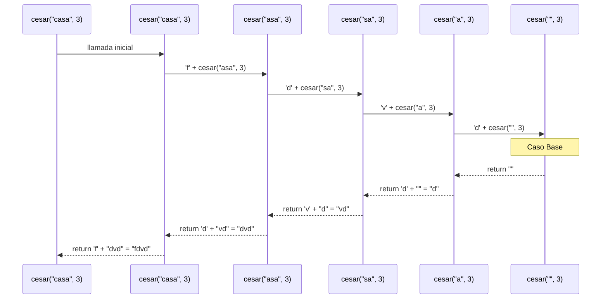
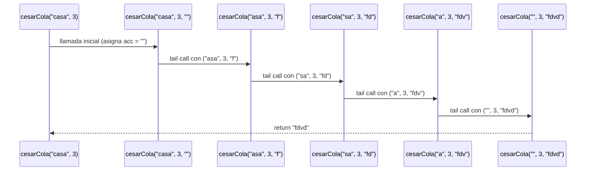
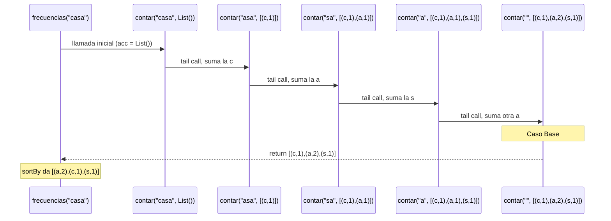
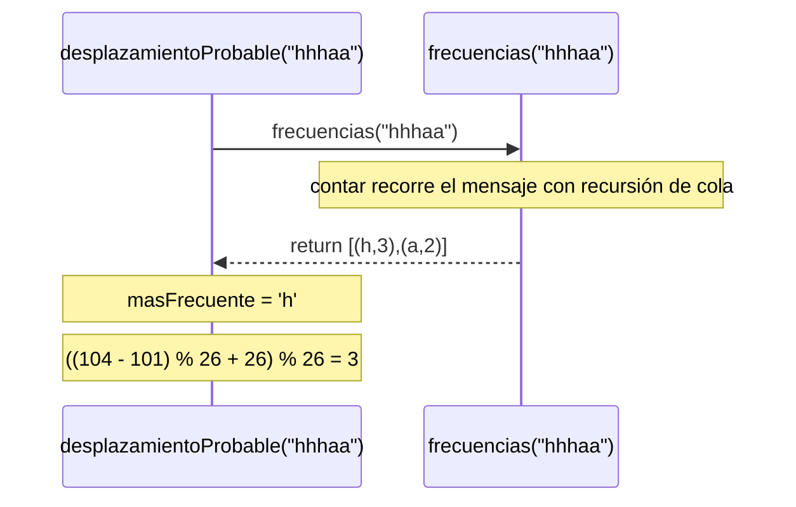
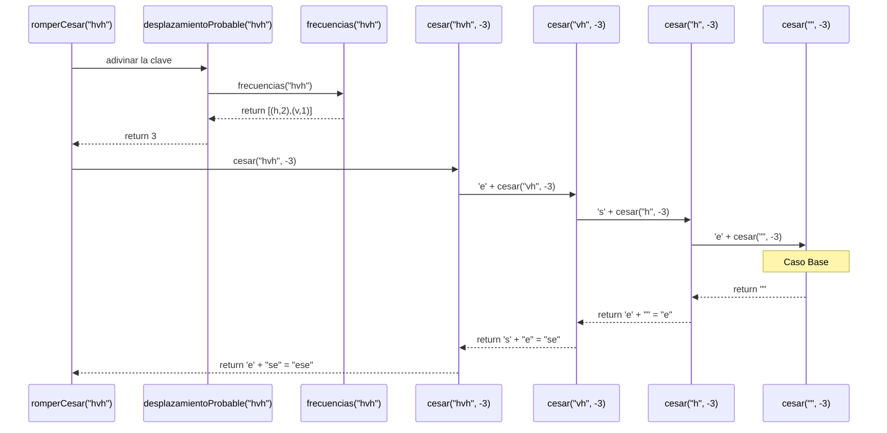

# Algoritmo Cesar con Recursión Lineal

### Tabla de Códigos ASCII (Minúsculas a-z)

| Letra | Código ASCII | Posición (0-25) |
| :---: | :----------: | :-------------: |
|   a   |      97      |        0        |
|   b   |      98      |        1        |
|   c   |      99      |        2        |
|   d   |     100      |        3        |
|   e   |     101      |        4        |
|   f   |     102      |        5        |
|   g   |     103      |        6        |
|   h   |     104      |        7        |
|   i   |     105      |        8        |
|   j   |     106      |        9        |
|   k   |     107      |       10        |
|   l   |     108      |       11        |
|   m   |     109      |       12        |
|   n   |     110      |       13        |
|   o   |     111      |       14        |
|   p   |     112      |       15        |
|   q   |     113      |       16        |
|   r   |     114      |       17        |
|   s   |     115      |       18        |
|   t   |     116      |       19        |
|   u   |     117      |       20        |
|   v   |     118      |       21        |
|   w   |     119      |       22        |
|   x   |     120      |       23        |
|   y   |     121      |       24        |
|   z   |     122      |       25        |


```Scala
 def cesar(m: Mensaje, k: Int): Mensaje = {
     if(m.isEmpty){""}
     else {
       val c = m.head
       val charCifrado = if (c.isLetter && esMinuscula(c)) {
         (((c.toInt - primera + k) % 26 + letras) % 26 + primera).toChar
       } else {
         c
         }
       charCifrado + cesar(m.tail, k)
     }
  }
```

* la funcion `cesar` recorre toda la cadena carácter por carácter y aplica el cifrado César a las letras minúsculas. Los demás caracteres no cambian.
* Usa recursion lineal, cada llamada utiliza una llamada recursiva para procesar el resto de la cadena.
 * Recibe dos parametros:
   * `m`: es la cadena de texto o mensaje que se quiere cifrar.
   * `k`: es la clave que indica el numero de posiciones que se va a mover la letra.

## Explicación paso a paso
### Caso base

```Scala
 if(m.isEmpty){""}
```
Cuando m no tiene caracteres, devuelve una cadena vacia, se termina la recursion.

### Caso recursivo
Si la cadena no está vacia
```Scala
 val c = m.head
```
Se le asigna a c el primer carácter.

```Scala
 val charCifrado = if (c.isLetter && esMinuscula(c)) 
```
Se verifica que la cadena sea una letra y que sea minuscula  con `esMinuscula`, 
si cumple se asigna a `charCifrado` el resultado de lo que hay adentro de la condicion.

```Scala
 (((c.toInt - primera + k) % 26 + letras) % 26 + primera).toChar
```
* Según el codigo ASCII cada letra del mundo tiene un númeroasignado, 
  al hacer `c.toInt` se le dice que cambie `c` a 99 que es su número asignado.
  `primera` corresponde a  `a` con número 97. k es la clave, letras es el número de letras del abecedario.

  * `c.toInt - primera ` al restar el primer caracter menos la base
    el resultado da la posicion del caracter en nuestro abecedario, empezando desde 0.
  
  * `+ k`  aqui se aplica el cifrado sumando el número de posiciones que se va a mover según k.
    si  `k` es positiva avanza, si es negativa, retrocede.
  
  * si el resultado de `(c.toInt - primera + k)` es un numero mayor al numero de las letras del abecedario,
     se aplica `% 26`, el residuo de la division entre 26.
  
  * si es un número negativo, al hacer el módulo sigue siendo negativo y no hay posiciones negativas,
   se suma `+ letras`, la cantidad de letras del abecedario, a esa posicion negativa.
  
  * si el resultado de `(c.toInt - primera + k) % 26 ` es un número  positivo al sumar `+ letras`,
    se sale del rango letras, otra vez, entonces se vuelve aplicar `% 26`. Asi da un número entre 0-25.
  
  * Hasta aqui lleva la posicion exacta de la nueva letra.
  
  * `+ primera` se vuelve a sumar el codigo ASCII de la primera.
  
  * `.toChar` toma ese número  y lo muestra como el caracter que le corresponde.

## Llamados de pila en recursión lineal
Ejemplo:
### Paso 1: Llamada inicial

```Scala
cesar("casa", 3) 
```
### Paso 2: Primera iteración

```Scala
cesar("casa", 3) 
```
  * m no esta vacio. 
  * c= `c`
  * c es letra minuscula.
  * ((99 - 97 + 3) % 26 + 26) % 26 + 97 = 5 + 97 = 102 ('f'). 
  * 'f' + cesar("asa", 3), se queda esperando...

### Paso 3: Segunda iteración
```Scala
cesar("asa", 3) 
```
* m no está vacio.
* c= `a`
* c es letra minuscula.
* ((97 - 97 + 3) % 26 + 26) % 26 + 97 = 3 + 97 = 100 ('d').
* 'd' + cesar("sa", 3), se queda esperando...
* 'f' + ('d' + cesar("sa", 3)), se acomula en la pila.

### Paso 4: Tercera iteración
```Scala
cesar("sa", 3) 
```
* m no está vacio.
* c= `s`
* c es letra minuscula.
* ((115 - 97 + 3) % 26 + 26) % 26 + 97 = 21 + 97 = 118 ('v').
* 'v' + cesar("a", 3), se queda esperando...
* 'f' + 'd'+ ('v'+ cesar("a", 3)), se acomula en la pila.

### Paso 5: Cuarta iteración
```Scala
cesar("a", 3) 
```
* m no está vacio.
* c= `a`
* c es letra minuscula.
* ((97- 97 + 3) % 26 + 26) % 26 + 97 = 3 + 97 = 118 ('d').
* 'd' + cesar(" ", 3), se queda esperando...
* 'f' + 'd'+ 'v'('d'+ cesar(" ", 3)), se acomula en la pila.

### Paso 6: Caso base
```Scala
cesar(" ", 3) 
```
* m está vacio.
* devuelve " "

### Desapilado: Paso 6 al paso 5
* 'f' + 'd'+ 'v'('d'+ cesar(" ", 3)), esperaba ahora recibe " "
* 'f' + 'd'+ 'v'+('d'+ " ")
* resuelve ('d'+ " ") = 'd'

### Desapilado: Paso 5 al paso 4
* 'f' + 'd'+ ('v'+ cesar("a", 3)), esperaba ahora recibe 'd'
* 'f' + 'd'+ ('v'+ 'd')
* resuelve ('v'+ "d") = 'vd'

### Desapilado: Paso 4 al paso 3
* 'f' + ('d' + cesar("sa", 3)), esperaba ahora recibe 'vd'
*  'f' + ('d'+ "vd")
* resuelve ('d'+ "vd") = 'dvd'

### Desapilado: Paso 2 al paso 1
* 'f' + cesar("asa", 3), esperaba ahora recibe "dvd"
* 'f'+ 'dvd'
*  resuelve 'fdvd'

El resultado de cesar("casa", 3) es 'fdvd'

## Diagrama de llamados de pila con recursión de cola




# Algoritmo Cesar con Recursión en cola

## Definición del Algoritmo

```Scala
@tailrec
final def cesarCola(m: Mensaje, k: Int, acc: Mensaje = ""): Mensaje = {
if(m.isEmpty){acc}
else {
val c = m.head
val charCifrado = if (c.isLetter && esMinuscula(c)) {
(((c.toInt - primera + k) % 26 + letras) % 26 + primera).toChar
} else {
c
}
cesarCola (m.tail, k,acc + charCifrado)
}
}
```
* la funcion cesarCola al igual que la funcion cesar recibe un mensaje 
  y una clave para cifrarlo, recorre el texto letra a letra de principio a fin.
* Recibe dos parametros:
  * `m`: es la cadena de texto o mensaje que se quiere cifrar.
  * `k`: es la clave que indica el numero de posiciones que se va a mover la letra.

* El decorador `@tailrec` permite que el programa procese textos infinitos usando el mismo espacio de memoria.


## Explicación paso a paso

### Caso base

```Scala
if(m.isEmpty){acc}
```
Cuando m esta vacio devuelve lo que hay en el acomulador y termina la ejecucion


### Caso recursivo

```Scala
 cesarCola(m.tail, k, acc + charCifrado)
```

En cada llamada:
* Se reduce el tamaño del mensaje pasando solo lo que queda de la cadena (m.tail).
* Se calcula el cifrado del carácter actual (m.head) y se concatena al final del acumulador (acc + charCifrado).
* Al ser una recursión de cola, 
* la llamada a cesarCola es la última instrucción en ejecutarse, 
* permitiendo al compilador de Scala optimizar la pila de memoria.

## Llamados de pila en recursión de cola

Ejemplo:
### Paso 1: Llamado inicial
```Scala
cesarCola("hola", 3) // se asigna "" por defecto
```
Tambien podria ser  `cesarCola("casa", 3, "")`

### Paso 2: Primera iteración
```Scala
cesarCola("asa", 3, "f") // c = 'c' -> 'f' | acc = "" + "f"
```
### Paso 3: segunda iteración
```Scala
cesarCola("sa", 3, "fd") // c = 'a' -> 'd' | acc = "f" + "d"
```

### Paso 4: tercera iteración
```Scala
cesarCola("a", 3, "fdv") // c = 's' -> 'v' | acc = "fd" + "v"
```

### Paso 5: cuarta iteración
```Scala
cesarCola("", 3, "fdvd") // c = 'a' -> 'd' | acc = "fdv" + "d"
```

### Paso 6: quinta iteración

```Scala
return "fdvd" // m.isEmpty es verdadero, retorna acc
```

## Ejemplo de uso

```Scala
val mensajeCifrado = cesarCola("casa", 3)
println(mensajeCifrado) // "fdvd"
```

## Diferencia con recursión normal
El lineal necesita volver sobre sus pasos para construir el String final;
el de cola construye el String mientras avanza y no necesita regresar.


## Diagrama de llamados de pila con recursión de cola




# Algoritmo frecuencias con Recursión de cola

## Definición del Algoritmo

```Scala
def frecuencias(m: Mensaje): Frecuencias = {

  def sumarUno(letra: Char, lista: Frecuencias): Frecuencias = {
    if (lista.isEmpty) {List((letra, 1))}
    else if (lista.head._1 == letra) {(letra, lista.head._2 + 1) :: lista.tail}
    else {lista.head :: sumarUno(letra, lista.tail)}
  }

  @tailrec
  def contar(resto: Mensaje, acc: Frecuencias): Frecuencias = {
    if (resto.isEmpty) {acc}
    else {
      val c = resto.head
      val nuevoAcc = if (esMinuscula(c)) {
        sumarUno(c, acc)
      } else {
        acc
      }
      contar(resto.tail, nuevoAcc)
    }
  }

  contar(m, List()).sortBy(par => (-par._2, par._1))
}
```

* la funcion `frecuencias` cuenta cuántas veces aparece cada letra minúscula en el mensaje.
* Devuelve una lista de parejas `(letra, veces)`, por ejemplo `('a', 2)` quiere decir que la `a` aparece 2 veces.
* Recibe un parametro:
  * `m`: es el mensaje en el que se van a contar las letras.
* Por dentro tiene dos funciones auxiliares (el enunciado pide que las auxiliares vayan dentro de la función):
  * `contar`: recorre el mensaje letra por letra con **recursión de cola**. Esta es la que pide el enunciado.
  * `sumarUno`: le suma 1 a una letra dentro de la lista del conteo.
* Al final se ordena la lista con `sortBy`, que es un método de la biblioteca (el enunciado dice que el ordenamiento sí puede usar la biblioteca).

## Explicación paso a paso

### Función auxiliar `sumarUno`

Recibe una letra y la lista que se lleva hasta el momento, y devuelve la lista con esa letra sumada.

```Scala
if (lista.isEmpty) {List((letra, 1))}
```
Si se recorrió toda la lista y la letra no estaba, se agrega por primera vez con 1.

```Scala
else if (lista.head._1 == letra) {(letra, lista.head._2 + 1) :: lista.tail}
```
* `lista.head` es la primera pareja de la lista, por ejemplo `('a', 1)`.
* `._1` es la letra de la pareja y `._2` es el número de veces.
* Si la primera pareja es la de la letra que buscamos, se cambia por una pareja con una vez más,
  y se le pega el resto de la lista con `::`.

```Scala
else {lista.head :: sumarUno(letra, lista.tail)}
```
Si la primera pareja no es la de la letra, se deja igual y se sigue buscando en el resto.
Esta parte es recursión lineal, pero la lista nunca tiene más de 26 parejas (una por letra),
así que como mucho deja 26 llamados pendientes, sin importar qué tan largo sea el mensaje.

### Función auxiliar `contar`

Es la que recorre el mensaje. Recibe:
* `resto`: lo que falta por recorrer del mensaje.
* `acc`: el acumulador, la lista con el conteo de lo que ya se recorrió.

#### Caso base

```Scala
if (resto.isEmpty) {acc}
```
Cuando ya no quedan caracteres por recorrer, devuelve lo que hay en el acumulador y termina la recursion.

#### Caso recursivo

```Scala
val c = resto.head
```
Se le asigna a c el primer carácter de lo que falta.

```Scala
val nuevoAcc = if (esMinuscula(c)) {
  sumarUno(c, acc)
} else {
  acc
}
```
* Si `c` es una letra minúscula, se suma en el acumulador con `sumarUno`.
* Si no lo es (un espacio, un número, una mayúscula, una tilde), el acumulador queda igual.

```Scala
contar(resto.tail, nuevoAcc)
```
* Se llama otra vez a `contar` con el mensaje sin su primer carácter (`resto.tail`) y el acumulador nuevo.
* Al ser una recursión de cola, la llamada a `contar` es la última instrucción en ejecutarse,
  no queda nada pendiente, y por eso el compilador acepta la anotación `@tailrec` y la pila no crece.

### Ordenamiento final

```Scala
contar(m, List()).sortBy(par => (-par._2, par._1))
```
* `contar(m, List())` empieza el recorrido con el mensaje completo y el acumulador vacío.
* `sortBy` ordena la lista por la pareja `(-veces, letra)`:
  * `-par._2`: se pone el número de veces en negativo para que quede de **mayor a menor**.
  * `par._1`: si dos letras empatan en veces, se ordenan por la letra, es decir en **orden alfabético**.

## Llamados de pila en recursión de cola

Ejemplo:
### Paso 1: Llamado inicial
```Scala
frecuencias("casa") // llama a contar("casa", List())
```

### Paso 2: Primera iteración
```Scala
contar("casa", List())
```
* resto no está vacio.
* c = `c`, es letra minúscula.
* sumarUno('c', List()) → la lista está vacía, devuelve List(('c',1)).
* llama a contar("asa", List(('c',1))) y no queda nada pendiente.

### Paso 3: Segunda iteración
```Scala
contar("asa", List(('c',1)))
```
* c = `a`, es letra minúscula.
* sumarUno('a', List(('c',1))):
  * ('c',1) no es la `a`, queda pendiente ('c',1) :: sumarUno('a', List())
  * sumarUno('a', List()) devuelve List(('a',1))
  * se resuelve ('c',1) :: List(('a',1)) = List(('c',1), ('a',1))
* llama a contar("sa", List(('c',1), ('a',1))).

### Paso 4: Tercera iteración
```Scala
contar("sa", List(('c',1), ('a',1)))
```
* c = `s`, es letra minúscula.
* sumarUno('s', ...) pasa por ('c',1) y ('a',1), no encuentra la `s` y la agrega al final.
* llama a contar("a", List(('c',1), ('a',1), ('s',1))).

### Paso 5: Cuarta iteración
```Scala
contar("a", List(('c',1), ('a',1), ('s',1)))
```
* c = `a`, es letra minúscula.
* sumarUno('a', ...):
  * ('c',1) no es la `a`, queda pendiente ('c',1) :: sumarUno('a', List(('a',1), ('s',1)))
  * ('a',1) sí es la `a`, devuelve ('a',2) :: List(('s',1))
  * se resuelve ('c',1) :: List(('a',2), ('s',1)) = List(('c',1), ('a',2), ('s',1))
* llama a contar("", List(('c',1), ('a',2), ('s',1))).

### Paso 6: Caso base
```Scala
contar("", List(('c',1), ('a',2), ('s',1)))
```
* resto está vacio, devuelve el acumulador List(('c',1), ('a',2), ('s',1)).

### Paso 7: Ordenamiento
* `sortBy` ordena por (-veces, letra): (-2,'a'), (-1,'c'), (-1,'s').
* La `a` va primero porque tiene más veces; la `c` y la `s` empatan y quedan en orden alfabético.

El resultado de frecuencias("casa") es List(('a',2), ('c',1), ('s',1))

### Estado de la pila en cada paso

| Paso | Pila de llamados de `contar` | acc |
| :---: | :--- | :--- |
| 2 | contar("casa", ...) | List() |
| 3 | contar("asa", ...) | List(('c',1)) |
| 4 | contar("sa", ...) | List(('c',1), ('a',1)) |
| 5 | contar("a", ...) | List(('c',1), ('a',1), ('s',1)) |
| 6 | contar("", ...) | List(('c',1), ('a',2), ('s',1)) |

En todos los pasos hay **un solo** llamado de `contar` en la pila: cada llamado
reemplaza al anterior porque no le deja nada pendiente. Lo único que se
apila por un momento son los llamados de `sumarUno`, y como mucho son 26.

## Diagrama de llamados de pila con recursión de cola




# Algoritmo desplazamientoProbable

## Definición del Algoritmo

```Scala
def desplazamientoProbable(m: Mensaje): Int = {
  val lista = frecuencias(m)
  if (lista.isEmpty) {0}
  else {
    val masFrecuente = lista.head._1
    ((masFrecuente.toInt - 'e'.toInt) % letras + letras) % letras
  }
}
```

* la funcion `desplazamientoProbable` adivina con qué `k` se cifró un mensaje con César.
* La idea es que en español la letra que más se repite es la `e`. Si en el mensaje cifrado
  la letra que más se repite es la `h`, lo más probable es que la `h` antes era una `e`,
  y de la `e` a la `h` hay 3 posiciones, entonces `k` = 3.
* Recibe un parametro:
  * `m`: el mensaje cifrado.
* No es recursiva: usa `frecuencias`, que es la que hace el recorrido recursivo.

## Explicación paso a paso

### Caso sin letras

```Scala
val lista = frecuencias(m)
if (lista.isEmpty) {0}
```
Si el mensaje no tiene ninguna letra minúscula, `frecuencias` devuelve una lista vacía
y el desplazamiento estimado es 0, como pide el enunciado.

### Caso con letras

```Scala
val masFrecuente = lista.head._1
```
Como `frecuencias` ya viene ordenada de mayor a menor, la primera pareja es la letra más frecuente.
Si hay empate, `frecuencias` deja primero la menor alfabéticamente, así que también se cumple
la regla de empate del enunciado sin hacer nada más.

```Scala
((masFrecuente.toInt - 'e'.toInt) % letras + letras) % letras
```
* `masFrecuente.toInt - 'e'.toInt`: según el codigo ASCII, es la distancia entre la `e` (101) y la letra más frecuente.
* Si la letra está antes de la `e` (por ejemplo la `a`), la resta da negativa, por eso se hace lo mismo que en `cesar`:
  `% letras`, luego `+ letras` y otra vez `% letras`, para que el resultado quede siempre entre 0 y 25.

## Llamados de pila

Ejemplo:
### Paso 1: Llamada inicial
```Scala
desplazamientoProbable("hhhaa")
```

### Paso 2: Se llama a frecuencias
```Scala
frecuencias("hhhaa")
```
* Hace el recorrido de cola que se explicó arriba y devuelve List(('h',3), ('a',2)).
* La pila vuelve a quedar solo con desplazamientoProbable.

### Paso 3: Se calcula la distancia
* la lista no está vacía.
* masFrecuente = `h`
* ((104 - 101) % 26 + 26) % 26 = (3 + 26) % 26 = 3

El resultado de desplazamientoProbable("hhhaa") es 3

Con el ejemplo del empate del enunciado, `"hhhaaa"`, la lista es List(('a',3), ('h',3)), gana la `a` y queda
((97 - 101) % 26 + 26) % 26 = (-4 + 26) % 26 = 22.




# Algoritmo romperCesar

## Definición del Algoritmo

```Scala
def romperCesar(m: Mensaje): Mensaje = {
  val k = desplazamientoProbable(m)
  cesar(m, -k)
}
```

* la funcion `romperCesar` descifra un mensaje cifrado con César sin saber la clave.
* Recibe un parametro:
  * `m`: el mensaje cifrado.
* Primero adivina la clave con `desplazamientoProbable` y después usa `cesar` (Punto 1)
  con la clave en negativo, porque descifrar es correr las letras hacia atrás.

## Explicación paso a paso

```Scala
val k = desplazamientoProbable(m)
```
Se le asigna a `k` el desplazamiento más probable del mensaje.

```Scala
cesar(m, -k)
```
Se corre cada letra `k` posiciones hacia atrás con la función `cesar` del Punto 1.
Los caracteres que no son letras minúsculas pasan sin cambio, porque así funciona `cesar`.

## Llamados de pila

Ejemplo: el mensaje `"ese"` cifrado con `k = 3` es `"hvh"`.
### Paso 1: Llamada inicial
```Scala
romperCesar("hvh")
```

### Paso 2: Se adivina la clave
```Scala
desplazamientoProbable("hvh")
```
* llama a frecuencias("hvh"), que devuelve List(('h',2), ('v',1)).
* masFrecuente = `h`
* ((104 - 101) % 26 + 26) % 26 = 3
* devuelve 3 y la pila vuelve a quedar solo con romperCesar.

### Paso 3: Se descifra
```Scala
cesar("hvh", -3)
```
`cesar` es recursión lineal, así que aquí la pila sí crece, un llamado por letra:
* 'e' + cesar("vh", -3), se queda esperando...
* 'e' + ('s' + cesar("h", -3)), se queda esperando...
* 'e' + ('s' + ('e' + cesar("", -3))), se queda esperando...
* cesar("", -3) es el caso base, devuelve ""

### Desapilado
* 'e' + ""  = "e"
* 's' + "e" = "se"
* 'e' + "se" = "ese"

El resultado de romperCesar("hvh") es "ese"


